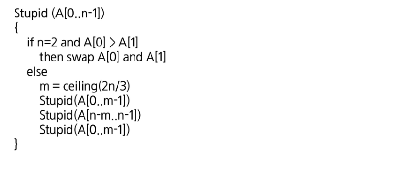

# 재귀

> 김주호, 현종일, 유현수, 이유현


## 2번 - Merge Sort Time Complexity Proof

- Merge Sort가 진행되는 과정을 직접 그려보고 각 단계에서 어떤 일이 일어나는지 생각해보세요.
- 기초 수식에서 학습한 재귀식으로 표현하면 어떻게 되는지 같이 생각해보세요.


-----


> #### Merge Sort 수도코드

```pseudocode
mergeSort(A[],p,r){
    if(p<r) then{
        q <- (p+r)/2;
        mergeSort(A,p,q);
        mergeSort(A,q+1,r);
        merge(A, p, q, r);
    }
}

merge(A[], p, q, r){
    정렬되어 있는 배열 A[p..q]와 A[q+1...r]을 합하여
    정렬된 하나의 배열 A[p...r]을 만든다.
}
```


> #### Merge Sort 파이썬 코드

```python
def merge_sort(unsorted_list):
    if len(unsorted_list) <= 1:
        return unsorted_list

    mid = len(unsorted_list)//2
    left = unsorted_list[:mid]
    right = unsorted_list[mid:]

    left1 = merge_sort(left)
    right1 = merge_sort(right)
    return merge(left1, right1)

def merge(left, right):
    result = []
    while len(left) > 0 or len(right) > 0:
        if len(left) > 0 and len(right) > 0:
            if left[0] <= right[0]:
                result.append(left[0])
                left = left[1:]
            else:
                result.append(right[0])
                right = right[1:]
        elif len(left) > 0:
            result.append(left[0])
            left = left[1:]
        elif len(right) > 0:
            result.append(right[0])
            right = right[1:]
    return result
```


> #### Merge Sort 시간 복잡도

데이터가 n개 일 때 합병 정렬로 계산하는 시간을 T(n) 이라고 가정하고, 정렬을 위해서 반으로 분할 한 뒤, 각 블럭에 대한 정렬을 수행해야 하므로 `T(n/2) + T(n/2)`의 시간이 걸립니다. 또한 두개의 정렬된 블럭을 merge할 때 두 블럭을 한 번씩 비교하므로 merge 시간은 n입니다.

따라서, Merge Sort의 시간 복잡도는 `T(n) = T(n/2) + T(n/2) +n` 이 됩니다.


-----


> #### 각 정렬법 시간복잡도 비교 표


-----


## 4번 




> $$
> O(n2.7095...)
> $$


