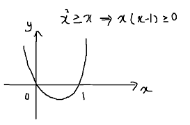
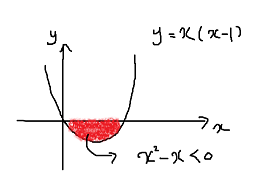

# 논리와 증명 

### 2조: 한채은, 박기웅, 박해인, 이건희

## 1-2 번

                              

|  p   |  q   | ~p ∨ q | p∧~q | ~(~p∧q) ∨ (p ∧~q) |
| :--: | :--: | :----: | :--: | :---------------: |
|  T   |  T   |   T    |  F   |         T         |
|  T   |  F   |   F    |  T   |         T         |
|  F   |  T   |   T    |  F   |         T         |
|  F   |  F   |   T    |  F   |         T         |

## 2-2 번  

##### 모순명제

> 논리식 혹은 합성명제에 있어서 그 명제를 구성하는 단순 명제들의 진리값에 관계없이 그 합성 명제의 진리값이 항상 거짓의 값을 가지는 것

|  p   |  q   | p ∧ q | p∧~q | (~p∧q) ∧ (p ∧~q) |
| :--: | :--: | :---: | :--: | :--------------: |
|  T   |  T   |   T   |  F   |        F         |
|  T   |  F   |   F   |  T   |        F         |
|  F   |  T   |   F   |  F   |        F         |
|  F   |  F   |   F   |  F   |        F         |

## 3-2 번

|  p   |  q   | ~p ∨ ~q | p ∨ q | ~(p∨q) |
| :--: | :--: | :-----: | :---: | :----: |
|  T   |  T   |    F    |   T   |   F    |
|  T   |  F   |    T    |   T   |   F    |
|  F   |  T   |    T    |   T   |   F    |
|  F   |  F   |    T    |   F   |   T    |

## 4-2 번

## 5-2 번 & 5-4번

**5-2번**

**모든 x는 정수이므로 0<x<1인 경우가 없다. 그러므로 참이다.**

**5-4번**

**x^2 < x 는 0<x<1에서만 만족, 그러므로 거짓이다.**

# 7번

$$
n = 2k-1\\
n^2 + n = (2k-1)^2 + 2k-1\\
= 4k^2 - 4k +1 +2k -1 \\
= 4k^2 -2k\\
= 2k(2k-1)
$$

n이 홀수, 2k-1로 표현 가능

즉 2 * 자연수이므로 n^2 + n은 항상 짝수이다.

## 9번

명제: 자연수 n에 대해, n^2 + 5가 홀수이면, n은 짝수이다.

대우: n이 홀수면, n^2 + 5는 짝수이다.

n은 자연수 k에 대해 2k-1로 나타낼 수 있다.

$$
n^2 + 5 = (2k-1)^2 + 5\\
= 4k^2 - 4k + 6 \\
= 2(k^2-2k+3)
$$
2 * 자연수 이므로 대우명제는 참이다.

대우가 참이므로, 원래 명제 역시 참이다.

## 10번

명제: n^2가 짝수면, n은 짝수이다.

대우: n이 홀수면, n^2는 홀수이다.

n은 자연수 k에 대해 2k-1로 나타낼 수 있다.

$$
n^2 = (2k-1)^2\\
= 4k^2 -4k +2 -1\\
= 2(2k^2-2k+1)-1\\
$$
2 * 자연수 -1 이므로 n^2은 홀수이다. 즉, 대우명제는 참이다.

대우가 참이므로, 원래 명제 역시 참이다.

## 11번

n이 짝수인 경우: 2k

n이 홀수인 경우: 2k-1

##### 1. n이 짝수일 때

명제: n^2가 짝수면, n은 짝수이다.

대우: n이 홀수면, n^2는 홀수이다.

n은 자연수 k에 대해 2k-1로 나타낼 수 있다.

$$
n^2+5n+3 = 4k^2 + 10k +3 \\
= 4k^2 + 10k +4 -1\\
= 2(2k^2+5k+2)-1\\
$$
2 * 자연수 -1 이므로 n이 짝수일 때, n^2 +5n +3은 홀수이다.

##### 2. n이 홀수일 때

$$
n^2+5n+3 = (2k-1)^2 + 5(2k-1) + 3 \\
= 4k^2 -4k + 1 + 10k -5 + 3\\
= 4k^2 +6k -1\\
2(k^2 +3k) -1
$$
2 * 자연수 -1 이므로 n이 홀수 일 때, n^2 +5n +3은 홀수이다.

즉, n^2+5n+3은 항상 홀수이다.

## 12번

대우: n이 3의 배수가 아니면 n^2도 3의 배수가 아니다.

n이 3의 배수가 아닌 경우;

n = 3k+1 or n = 3k+2

##### 1. n = 3k+1

$$
n^2 = (3k+1)^2 \\
= 9k^2 + 6k + 1 \\
= 3(3k^2 + 2k) + 1
$$

##### 2. n = 3k+2

$$
n^2 = (3k+2)^2 \\
= 9k^2 + 12k + 4 \\
= 9k^2 + 12k + 3 + 1 \\
= 3(3k^2 + 4k +1) + 1
$$

대우가 항상 참이므로, 명제도 참이다.

