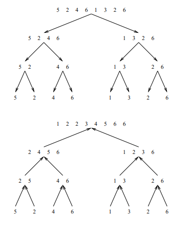
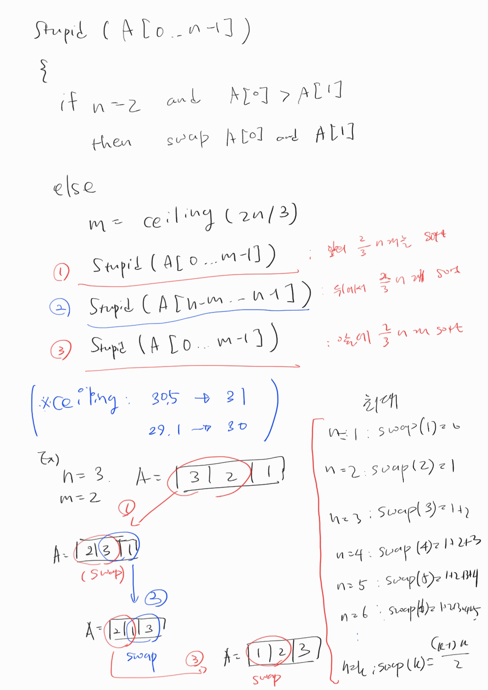
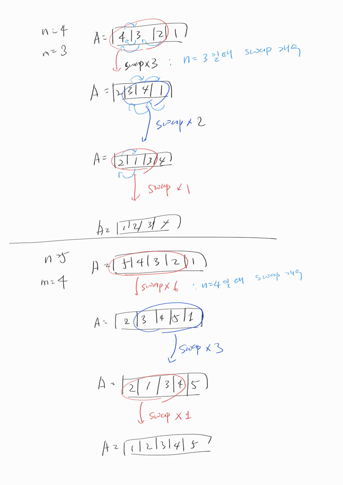
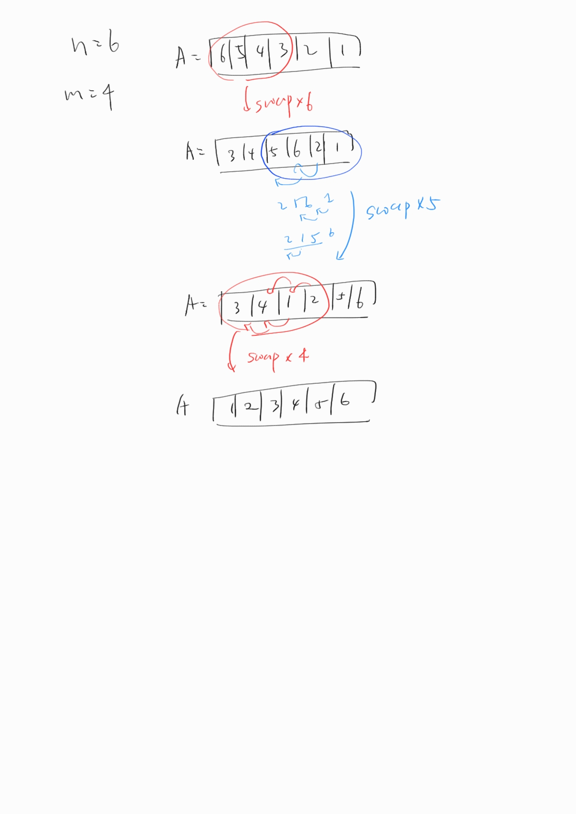

# 재귀

### 2조: 한채은, 박기웅, 박해인, 이건희

## 2번 - Merge Sort Time Complexity Proof

- Merge Sort가 진행되는 과정을 직접 그려보고 각 단계에서 어떤 일이 일어나는지 생각해보세요.
- 기초 수식에서 학습한 재귀식으로 표현하면 어떻게 되는지 같이 생각해보세요.

#### 합병 정렬(merge sort) 알고리즘의 개념 요약

- 일반적인 방법으로 구현했을 때 이 정렬은 안정 정렬 에 속하며, 분할 정복 알고리즘의 하나 이다.
  - 분할 정복(divide and conquer) 방법
    - 문제를 작은 2개의 문제로 분리하고 각각을 해결한 다음, 결과를 모아서 원래의 문제를 해결하는 전략이다.
    - 분할 정복 방법은 대개 순환 호출을 이용하여 구현한다.
- 과정 설명
  1. 리스트의 길이가 0 또는 1이면 이미 정렬된 것으로 본다. 그렇지 않은 경우에는
  2. 정렬되지 않은 리스트를 절반으로 잘라 비슷한 크기의 두 부분 리스트로 나눈다.
  3. 각 부분 리스트를 재귀적으로 합병 정렬을 이용해 정렬한다.
  4. 두 부분 리스트를 다시 하나의 정렬된 리스트로 합병한다.

## 4번 

- 시간 복잡도
  $$
  T(n) = 2T\frac{n}{2} + n-1 \\
  = 2(2T\frac{n}{4}+ \frac{n}{2} -1) + n-1 = 4T(\frac{n}{4} + 2n-3)\\
  = 4(2T\frac{n}{8}+ \frac{n}{4} -1) + 2n-3 = 8T(\frac{n}{8} + 3n-7)\\
  ...
  = 2^k * T(\frac{n}{2}^k) + kn-(2^k-1)\\
  = n * T(1) + n * logn-n+1\\
  = n+n*logn-n +1\\
  = nlogn +1\\
  $$
  

따라서 시간복잡도는 O(n logn) 이다.

## 참고자료

http://www.bowdoin.edu/~ltoma/teaching/cs231/fall16/Lectures/02-recurrences/recurrences.pdf

https://www.cs.princeton.edu/courses/archive/spr07/cos226/lectures/04MergeQuick.pdf

