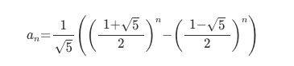

# 동적 프로그래밍

### 2조: 한채은, 박기웅, 박해인, 이건희

## 2번

* 점화식:

 F[i] = F[i-1] + F[i-2] -> An = An-1 + An-2 -> An+2 = An+1 + An (귀납적 정의)

* 일반식:
* 

수열에서 항수는 차수가 다른 방정식과 동일하게 볼 수 있다 -> x2 = x + 1 -> x2 -x -1 = 0 -> px2 - qx - r = 0 >

p = 1, q = -1, r = -1, 근과 계수의 관계는 A + B = 1, AB = -1이므로,

즉, 피보나치수열의 일반항은

* 해당 일반항은 피보나치 수열의 조건을 만족한다.
* 따라서 피보나치 수열의 생성조건은 참이 될 수 있다.
