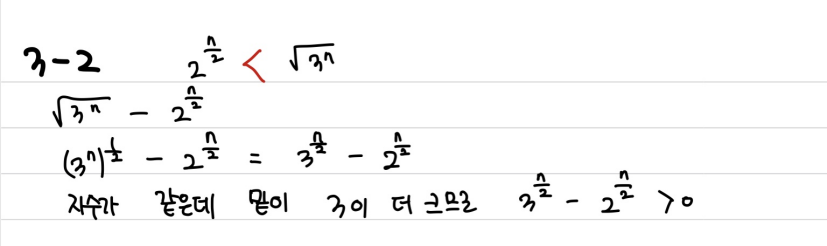
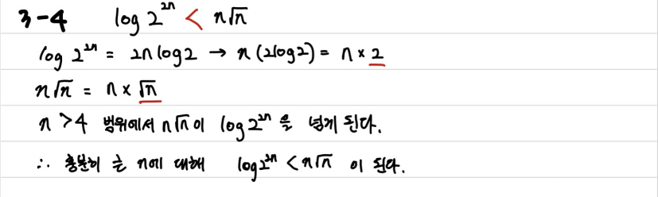
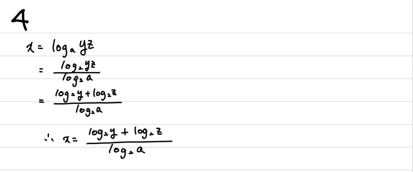
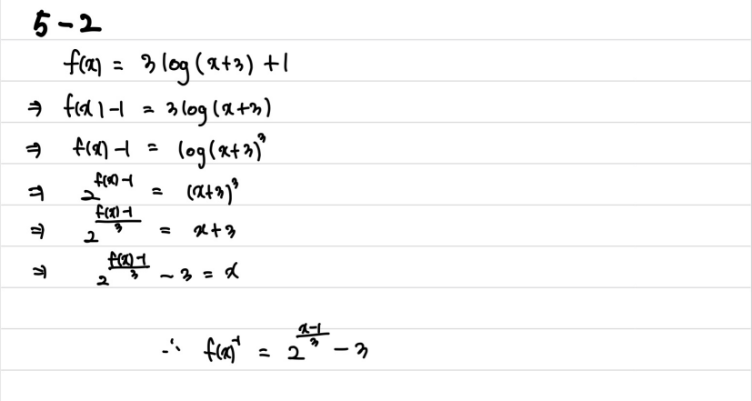

# 수와 표현

> 함께 학습하고 고민하고 설명하며 작은 부분 하나라도 '내 것'으로 만들어보세요. 😁

## 2 번

Ans) 각 턴마다 질문에 대한 답을 통해 맞출 수 있는 정답의 종류가 2개씩 생겨나게 된다. 따라서 2^20개의 종류를 가질 수 있다.

## 3-2 & 3-4 번

**3-2번**

**3-4번**

## 4번

Ans)

## 5-2번

Ans)

