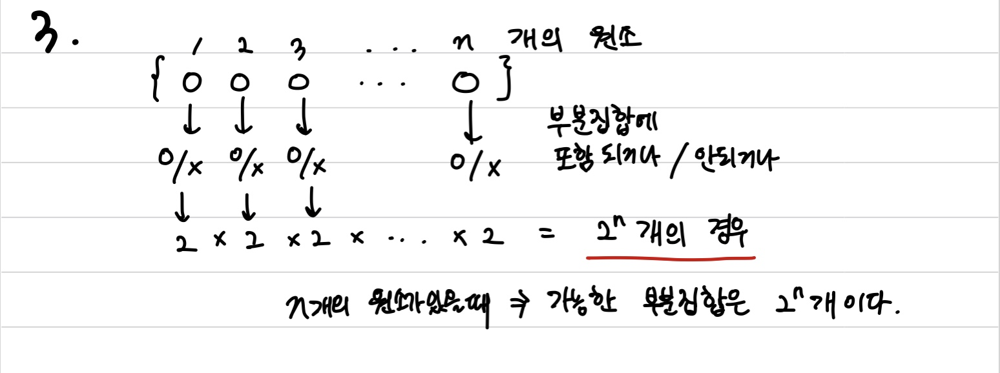

# 집합과 조합

> 함께 학습하고 고민하고 설명하며 작은 부분 하나라도 '내 것'으로 만들어보세요. 😁

 
## 3 번

Ans)

원소의 개수가 0,1,2...k...n개일때의 부분집합의 수는 nC0,nC1,nC2,...nCk...nCn개이다.

위 식에 x = y = 1을 대입한다면

2^n = nC0 + nC1 + nC2 + ... + nCn이기에 증명할 수 있다.

## 10 번

Ans)

4자리 : 10^4

5자리 : 10^5

6자리 : 10^6

이므로 가지수는 111 * 10^4이다.

## 13 번

Ans)

무늬 같은 카드는 13개씩 존재, 무늬는 4종류

(13C3 * 39C2 ) * 4

(286*741) * 4 = 847,704 개의 경우의 수가 존재

## 16 번

Ans)

서로 다른 5개 카드 뽑기 * 무늬별로 뽑는 경우의수

13C5 * 4^5 = 1,317,888가지