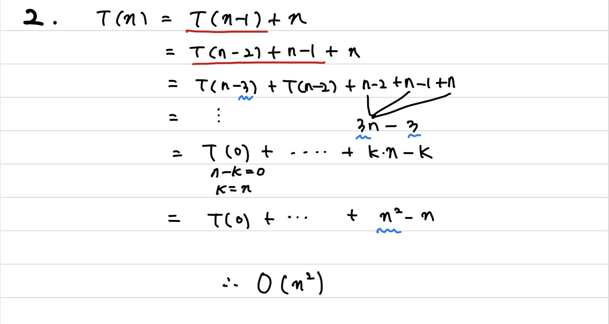
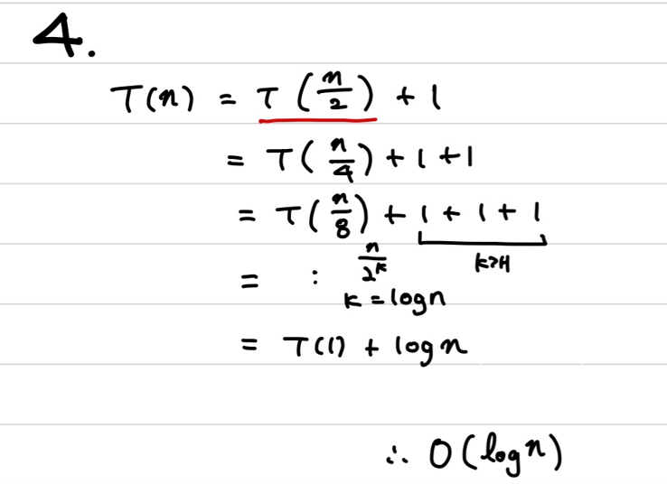
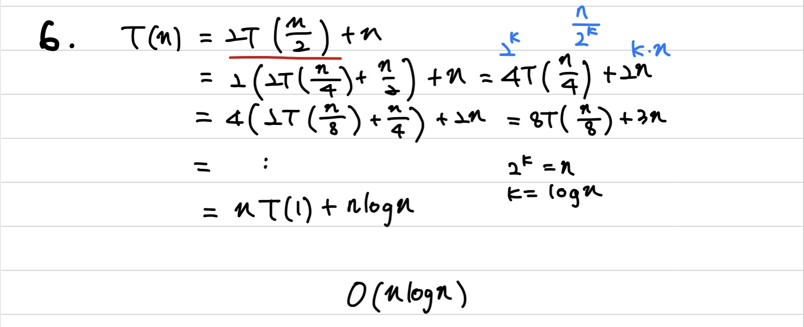

# 기초 수식

> 함께 학습하고 고민하고 설명하며 작은 부분 하나라도 '내 것'으로 만들어보세요. 😁

## 2 번

- `T(0) = 1`로 설정하고 진행

## 4번

- `T(1) = 1`로 설정하고 진행

Ans)

## 6번

Ans)

## 8번

Ans)

## 참고 자료

https://www.radford.edu/~nokie/classes/360/recurrence.eqns.revised.html
