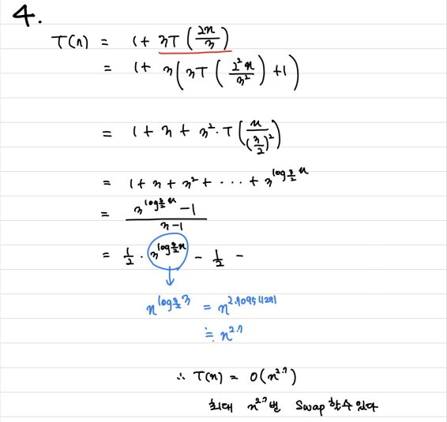

# 재귀

> 함께 학습하고 고민하고 설명하며 작은 부분 하나라도 '내 것'으로 만들어보세요. 😁


## 2번 - Merge Sort Time Complexity Proof

- Merge Sort가 진행되는 과정을 직접 그려보고 각 단계에서 어떤 일이 일어나는지 생각해보세요.
- 기초 수식에서 학습한 재귀식으로 표현하면 어떻게 되는지 같이 생각해보세요.


기초 수식 : O(nlogn) , 깊이(n) * 각 깊이별 연산(logn)

``` python
def merge_sort(lst):
    if len(lst) <= 1:
        return lst
    mid = len(lst)//2
    l = merge_sort(lst[:mid])
    r = merge_sort(lst[mid:])
    
    i = j = k = 0
    while i < len(l) and j < len(r):
        if l[i] < g[j]:
            lst[k] = l[i]
            i += 1
        else:
            lst[k] = r[j]
            j += 1
        k += 1
        
    while i < len(l):
        lst[k] = l[i]
        i += 1
        k += 1
    while j < len(r):
        lst[k] = r[j]
        j += 1
        k += 1
   
```

``` 
# 수도 코드
MergeSort(A,p,r)
	if p < r then
		q = |(p+r)|/2
		MergeSort(A,p,q)
		MergeSort(A,q+1,r)
		Merge(A,p,q,r)
	else
		return
		
```


## 4번 


Ans)



병합정렬이므로 시간복잡도는 O(nlogn)이다. 따라서 최대 nlogn번 스왑한다.


## 참고자료

http://www.bowdoin.edu/~ltoma/teaching/cs231/fall16/Lectures/02-recurrences/recurrences.pdf

https://www.cs.princeton.edu/courses/archive/spr07/cos226/lectures/04MergeQuick.pdf