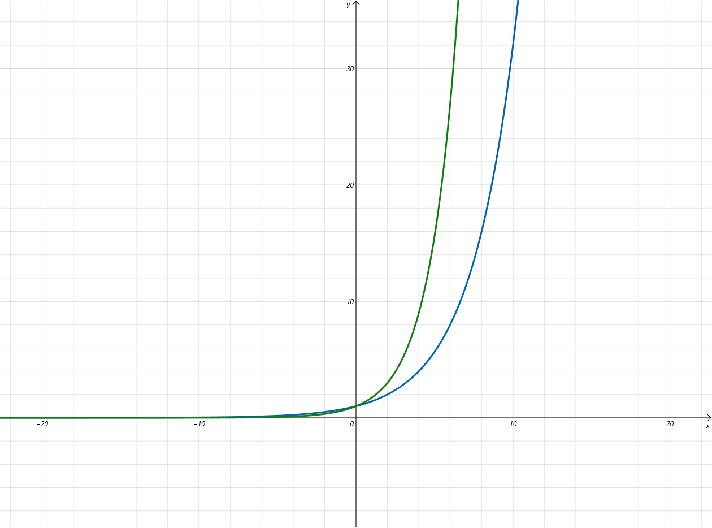
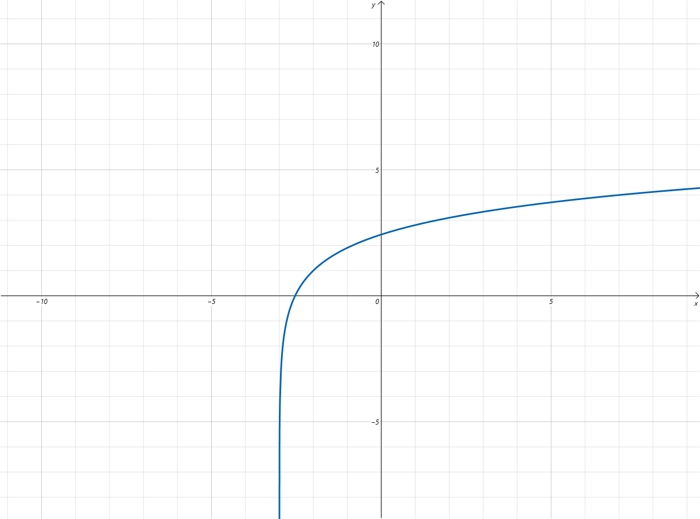
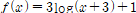
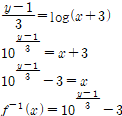

# 수와 표현 (김민현, 안재현, 윤숙, 윤여창)

> 함께 학습하고 고민하고 설명하며 작은 부분 하나라도 '내 것'으로 만들어보세요. 😁


## 2 번

질문을 한번 할때마다 예 또는 아니오 2가지 정답이 나오게 되므로 

각 질문횟수마다 2개의 정답이 나온다.


2^20


 


## 3-2 & 3-4 번

**3-2번**

파란색 :  2^(n/2)

초록색 : √3^n

n이 큰 값일 경우, 2의 거듭제곱의값과 3의 거듭제곱의 값을 비교하면 3의 거듭제곱값이 큼.


​		

**3-4번**

파란색 : log2^2n

초록색: n√n

log n과 log2값의 경우, n이 충분히 큰 수이기에 초록색이 더 크다.

)


## 4번

```
x = log yz #밑이 a

-> log yz = log y + log z 
-> log y / loga  + log z / log a #밑이 2임. 
-> log y +log z / log a
```


## 5-2번


  

  

    

