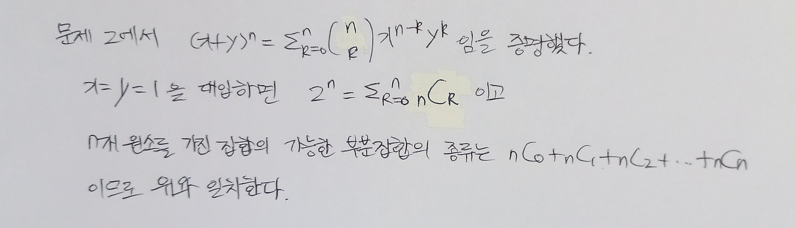

# 집합과 조합

> 함께 학습하고 고민하고 설명하며 작은 부분 하나라도 '내 것'으로 만들어보세요. 😁

## 3 번

## 10 번

10^4 + 10^5 + 10^6 = 111만가지

## 13 번

4가지 무늬가 있고 하나당 13개의 카드를 가진다.

4 * 13C3 * 39C2 = 847704가지

무늬 가짓수 * 한 무늬를 선택하고 거기서 3가지 카드를 뽑음  * 나머지 39 카드에서 2가지 카드를 뽑음

## 16 번

4개의 무늬 하나 당 13개의 숫자를 가진 것으로 가정했다.

13C5 * 4^5 = 1317888가지

13개 중애서 5개 숫자 조합 선택 * 5개 숫자 모두 4개 무늬 중 어떤 것이든 선택해도 되므로 숫자 하나 당 4를 곱함

**정리 예시**

